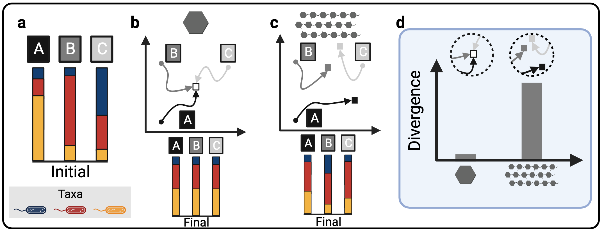

# Metabolic complexity drives divergence in microbial communities
[Michael Silverstein](https://michaelsilverstein.github.io/), [Jennifer Bhatnagar](https://microbesatbu.wordpress.com/), and [Daniel Segrè](https://www.bu.edu/segrelab/)

## Abstract
Microbial communities are shaped by the metabolites available in their environment, but the principles that govern whether different communities will converge or diverge in any given condition remain unknown, posing fundamental questions about the feasibility of microbiome engineering. To this end, we studied the longitudinal assembly dynamics of a set of natural microbial communities grown in laboratory conditions of increasing metabolic complexity. We found that different microbial communities tend to become similar to each other when grown in metabolically simple conditions, but diverge in composition as the metabolic complexity of the environment increases, a phenomenon we refer to as the divergence-complexity effect. A comparative analysis of these communities revealed that this divergence is driven by community diversity and by the diverse assortment of specialist taxa capable of degrading complex metabolites. An ecological model of community dynamics indicates that the hierarchical structure of metabolism itself, where complex molecules are enzymatically degraded into progressively smaller ones, is necessary and sufficient to recapitulate all of our experimental observations. In addition to pointing to a fundamental principle of community assembly, the divergence-complexity effect has important implications for microbiome engineering applications, as it can provide insight into which environments support multiple community states, enabling the search for desired ecosystem functions.

# Data
All 16S samples were processed into ASV tables using a [QIIME2](https://qiime2.org/) pipeline at Boston University: https://github.com/Boston-University-Microbiome-Initiative/BU16s.

All processed ASV tables and associated metadata files used in the manuscript are provided in this repository:

| Study | ASV Table | Metadata Table |
| --- | --- | --- |
| Meta-analysis | [ASV](data/metaanalysis/env_complexity_metaanalysis_asv.csv)| [Metadata](data/metaanalysis/env_complexity_metanalysis_md.csv) |
| Our's | [ASV](data/env_complexity_asv_publication.csv) | [Metadata](data/env_complexity_md_publication.csv)